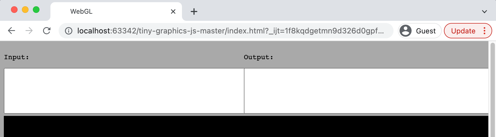
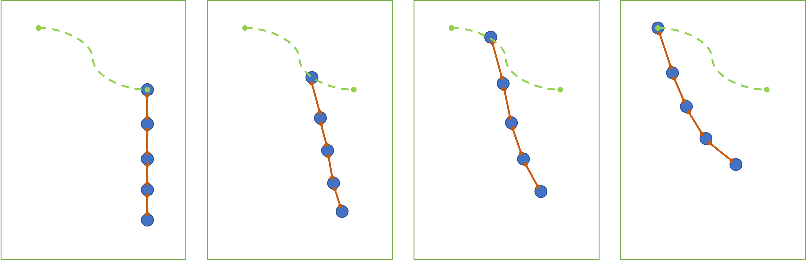

# **CS 174C: Assignment 1**

#### *Due Date: Check on BruinLearn*

-----------------------

### General Requirements

Your code must be implemented using the template code provided on BruinLearn. Make sure to implement all the **text-based commands** and **button events** specified below, as this is how we will test your code.

Create an introduction file named "README.md" (or in another format if you wish) and specify where you implement the bullet points (like "1-2: in line XXX-XXX", or "2-6: you should see XXX during animation"). This will help the grader to check your code and not miss a point.

### Part 1: Hermite Spline Modeling [15 points]

The code for this part should be written in `part_one_hermite.js` (you can implement the spline and helper classes in another file, but if you do so please specify this in your README document). All input/output behaviors should be implemented using the top input and output text boxes, and operations triggered by clicking buttons.



For this part, implement a Hermite spline class adhering to the following requirements:

1. [3 points] Your **Hermite spline** class should be able to handle at least 20 control points. 

2. [3 points] Manipulation of the control points and tangents using the shell-like text interaction. Implement the following commands: (Click the "Parse Commands" button to run all commands in the input text box, and multiple commands should be correctly handled in multiple lines)

```
> add point <x y z, sx, sy, sz>
```
Adds a point at position (x, y, z) with tangent (sx, sy, sz) at the end of the spline (this point should correspond to the parameter value t = 1).

```
> set tangent <index> <x y z>
```
Set the components of the tangent specified by index.

```
> set point <index> <x y z>
```
Set the components of the point specified by index.

3. [3 points] Arc length parameterization using a piecewise linear approximation and a look-up table. The following shell command should print the arc length of a spline. (print to output)
```
> get_arc_length
```

4. [2 points] Load a spine from the input text and export the current spine to the output text. Read from the input text when the "Load" button is clicked and export to the output text when the "Export" button is clicked.

Implement exactly the following format for the spline text:
```
<n>
<c_x1 c_y1 c_z1 t_x1 t_y1 t_z1> 
<c_x2 c_y2 c_z2 t_x2 t_y2 t_z2>
....
<c_xn c_yn c_zn t_xn t_yn t_zn>
```

where the prefix c_ refers to control points and the prefix t_ to tangents and n is the number of control points defined in the text. 

5. [4 points] Spline drawing. Update the scene after a button named "Draw" is clicked. The quality of the drawing also counts.

### Part 2: Mass-Spring-Damper System [15 Points]

The code for this part should be written in `part_two_spring.js`. All input/output behaviors should be implemented within the top input and output text boxes and operations triggered by clicking buttons.

Implement a mass-spring-damper system simulator that supports an arbitrary number of mass particles and damped springs. The particles must be connectible with damped springs in arbitrary ways and are subject to gravity. Include a flat ground constraint on the xz-plane, modeled using collision penalty forces. Your simulator should include the Forward Euler, Symplectic Euler, and Verlet time integration methods.

Similar to Part 1, in order to run the simulation, we first click the "Config" button to configure the scene, and then click the "Run" button to initialize the state and start the simulation.

You must implement the interface commands listed below. In grading the assignment, these commands will be called (during a particular invocation of the system) only in the order that they are given below. None of these commands need work after the simulation has been started by the user.

The commands are:

1. Create a particle system with the given number of particles. Particles may be initialized to
the origin, or may not appear at all until initialized by the next command.
```
create particles <Number of Particles>
```

2. Set the position, mass and velocity for a specific particle.
```
particle <index> <mass> <x y z vx vy vz>
```

3. Set the velocities of all the particles. (This command will overwrite the velocity settings from previous commands)
```
all_velocities <vx vy vz>
```

4. Create a simulator instance and initialize it to work with the given number of damped springs. Link the specified simulator object to the above particle system.
```
create springs <Number of Springs>
```

5. Connect a damped spring `sindex` between particle `pindex1` and particle `pindex2` with the given elasticity, viscosity, and natural length parameters, ks, kd, and length, respectively. If the value of length is a negative number, then the rest length is set to the current distance between the corresponding particles at the time the command is issued.
```
link <sindex> <pindex1> <pindex2> <ks> <kd> <length>
```

6. Change the integration technique used by the given simulator and set the time step of the integration.
```
integration <"euler" | "symplectic" | "verlet"> <timestep>
```

7. Set the elasticity and viscosity parameters of the ground constraint’s penalty damped springs to ks and kd, respectively.
```
ground <ks> <kd>
```

8. Set the acceleration due to gravity in units of m/sec2.
```
gravity <g>
```

Breakdown of grades:

- [3 points] Particle system
- [2 points] Script-based commands
- [2 points] Forward Euler
- [2 points] Symplectic Euler
- [2 points] Verlet
- [2 points] Ground collision forces and gravity
- [2 points] Particle and spring drawing

### Part 3: Simulate a Chain [10 Points]

The code for this part should be written in `part_three_chain.js`. In this part, there will be no text-based input/output or button events.



> This is an illustration in 2D. Your actual scene should be in 3D, have more particles in the chain, and have more control points in the spline. Also, the actual scene should move the top particle of the chain back-and-forth.

Reusing your classes and code from the previous two parts, create of a physical simulation of a viscoelastic chain. The chain should be implemented using the mass-spring-damper system with several particles linked in series with springs, like in the above illustration. The top particle of the chain should move **sinusoidally back and forth** along a 3D Hermite spline with an interesting shape. The remainder of the chain, hanging in gravity, should be simulated using the system you implemented in Part 2. 

You must specify the initial configuration and parameters of the scene to yield a reasonable and natural simulation. Therefore, there should be no buttons or commands and the scene should run from the start.

Breakdown of grades:

* [4 points] Create and draw the trajectory of the top particle of the chain, as was done in Part 1, and move the top particle of the chain along it. 
  * The Hermite spline should contain **at least 4 control points** and have reasonable positions and tangents to make the movement of the chain smooth. You can hardcode the spline data in your code.
  * The motion of the top particle should have a sine pattern (the t parameter of the spline goes from 0 to 1 as a sinusoidal function of time).
* [4 points] Simulate and draw the chain. The chain should be implemented with the mass-spring-damper system from Part 2. The chain should contain **at least 8 particles** (including the top one). Your spline trajectory must be such that **at least the bottom particle of your chain must collide with the ground plane at some point** during the sinusoidal cycle.
* [2 points] The overall drawing quality. No shadow, reflection, or texture are required. A simple yet clear demonstration will suffice.


## Advice

1. Make sure you follow the exact syntax specified in the assignment. We will be using the same set of scripts to test your code.
2. Your code should use 0-indexing, which means indices start at 0.
3. A lot of code is already provided. You do not need to write your own vector libraries; however, if you already have one, you may use it.
4. You may NOT use existing code for the splines.
5. Do not use spaces in file names.
6. Test your code using an up-to-date Chrome browser.
7. If your code doesn’t compile or doesn’t run, you will get 0 points.
8. If your code doesn’t parse the input text correctly, you will get 0 points.
9. You may want to implement additional commands to facilitate debugging.
10. Start the assignment right away and work incrementally!
