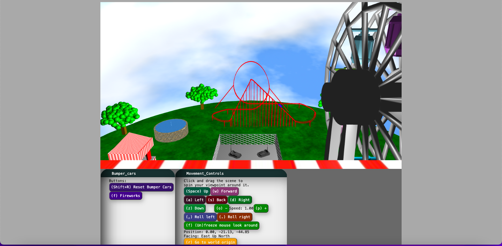

# Amusement Park
### CS 174C Final Project

## Group Members

Gayatri Puppala (805768600)
* worked on Particle System (Fireworks), Trees, Carnival Stalls

Pavana Atawale (805503073)
* Bezier Curves (Fountain)

Adithi Ramesh (105491865)
* Hermite Spline (Roller Coaster)

Ethan Dao (205687051)
* Collision Detection (Bumper Cars), Inverse Kinematics (Mascot), Ferris Wheel

# How to Run
Our code is on GitHub in the following project: https://github.com/gayatri-3/174C_Final_Project.git 

1. git clone https://github.com/gayatri-3/174C_Final_Project in terminal
2. Run the host file according to your system
   MacOS: host.command
   Windows: host.bat
3. Go to http://localhost:8000 in your browser

You should see a page that looks like the following screenshot.

### Special Notes
* Hit the "Reset Bumper Cars" button to view the bumper cars simulation.
* To see the fireworks, press the "Fireworks" button. Pressing it once turns the sky to night. To see the actual fireworks
display, just press the button again.
* The fountain is set up to start one stream at a time. Keep the simulation
running for a while to see the entire fountain.

# Project Elements
The animation algorithms we used in this project are as follows:
1. **Hermite Spline:** We used the Hermite Spline formula in our rollercoaster to 
create the track. We also made a car that followed the track, 
using the Spline formula to calculate the car's position and velocity 
throughout the simulation  

2. **Bezier Curve:** We used the De Casteljau algorithm to create a series of Bezier
curves, which made up our fountain. Then, we had particles follow each 
curve in a sequence to give the illusion of water flowing. 

3. **Collision Detection:** We used the collision detection algorithms in our bumper cars
to create realistic collisions.

4. **Time Integration with Particle Systems: Fireworks** 
We created a Firework class that holds position and velocity of each of the firework particles.
The FireworksDisplay class used the Firework class to create a display. 
It initializes a specified number of fireworks with random positions within a declared canvas space, velocities, and colors. 
Each firework is then updated over time based on gravitational forces, with bursts triggered when a firework reaches its peak height. 
When a burst occurs, additional particles are created to simulate the explosion effect. 

5. **Inverse Kinematics:** We used the inverse kinematics algorithm to create a 
teddy bear mascot dancing on a stage.

### Additional Elements
1. **Trees**
We created a TreeDrawer class that constructs a tree structure by recursively branching from a root particle. 
Each branch's direction is determined randomly, with the number of sub-branches varying. 
Branches are represented by particles connected by springs, with leaf particles generated at the ends.

2. **Carnival Stalls**
We used the shapes from the common-shapes.js file to crete a carnival stall using cylinders, cones, and cubes. 
We added custom textures to enhance the carnival feel.

3. **Ferris Wheel**
